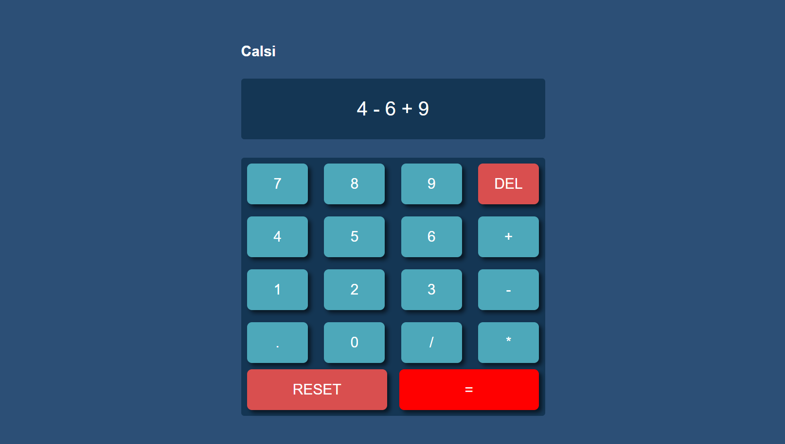

# Simple Calculator

A stylish and responsive web-based calculator built using **HTML**, **CSS**, and **JavaScript**.

## 📸 Screenshot
  

## 🚀 Features

- Basic arithmetic operations: **Addition (+), Subtraction (-), Multiplication (\*), and Division (/)**.
- Supports decimal inputs.
- "DEL" button to remove the last entered value.
- "RESET" button to clear all inputs.
- Responsive and visually appealing UI for seamless user experience.

## 🛠️ Technologies Used

- **HTML** for structure
- **CSS** for styling
- **JavaScript** (including **jQuery**) for functionality

## 🔧 How to Run

1. Clone the repository to your local machine:
   ```bash
   git clone https://github.com/Pawar-Sudharshan/simple_calculator.git
